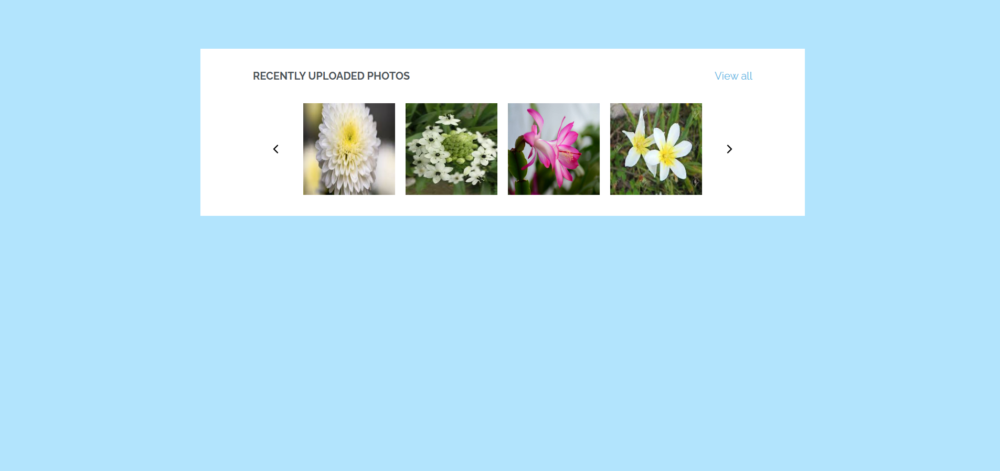

# Carrusel de Imágenes

Este proyecto implementa un carrusel de imágenes que permite a los usuarios navegar a través de varias fotos utilizando botones de anterior y siguiente.

## Descripción del Código

El código maneja la interacción del usuario con un conjunto de imágenes y permite cambiar la imagen visible mediante dos botones: "Anterior" y "Siguiente". 

### Estructura del Código

1. **Elementos del DOM**:
   - Se seleccionan todas las imágenes utilizando `querySelectorAll`.
   - Se obtienen los botones de navegación "Anterior" y "Siguiente".

2. **Matriz de URLs**:
   - Se define un arreglo `url` que contiene las rutas de las imágenes que se mostrarán en el carrusel.

3. **Eventos de Click**:
   - Se agrega un listener para el evento `click` en el documento.
   - Al hacer clic en el botón "Siguiente":
     - Se obtiene la `src` actual de cada imagen.
     - Se encuentra su índice en el arreglo `url`.
     - Se actualiza la imagen a la siguiente en el ciclo (volviendo al inicio si está en la última).
   - Al hacer clic en el botón "Anterior":
     - Similarmente, se actualiza la imagen a la anterior en el ciclo (volviendo al final si está en la primera).

### Vista de la página



### Ejemplo de HTML

```html
<div class="carousel">
    
    <button class="prev">Anterior</button>
    <button class="next">Siguiente</button>
</div>